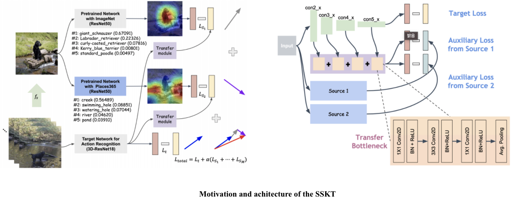

SSKT(under review at WACV2022)
================================

Concept map
-----------


Dataset
-------
* Image dataset
  * CIFAR10 (torchvision)
  * CIFAR100 (torchvision)
  * STL10 (torchvision)
  * Pascal VOC (torchvision)
  * ImageNet(I) (torchvision)
  * [Places365](http://places2.csail.mit.edu/download.html)(P)
* Video dataset
  * [UCF101](https://www.crcv.ucf.edu/data/UCF101.php)
  * [HMDB51](https://serre-lab.clps.brown.edu/resource/hmdb-a-large-human-motion-database/)

Pre-trained models
------------------
* __Imagenet__
  * we used the pre-trained model in torchvision. 
  * using resnet18, 50
* __Places365__
  * [Resnet50](https://github.com/CSAILVision/places365)

Option 
--------
* isSource
  * Single Source Transfer Module
  * Transfer Module X, Only using auxiliary layer
* transfer_module 
  * Single Source Transfer Module
* multi_source 
  * multiple task transfer learning

Training
--------
* 2D PreLeKT
```
 python main.py --model resnet20  --source_arch resnet50 --sourceKind places365 --result /raid/video_data/output/PreLeKT --dataset stl10 --lr 0.1 --wd 5e-4 --epochs 200 --classifier_loss_method ce --auxiliary_loss_method kd --isSource --multi_source --transfer_module
```

* 3D PreLeKT 
```
 python main.py --root_path /raid/video_data/ucf101/ --video_path frames --annotation_path ucf101_01.json  --result_path /raid/video_data/output/PreLeKT --n_classes 400 --n_finetune_classes 101 --model resnet --model_depth 18 --resnet_shortcut A --batch_size 128 --n_threads 4 --pretrain_path /nvadmin/Pretrained_model/resnet-18-kinetics.pth --ft_begin_index 4 --dataset ucf101 --isSource --transfer_module --multi_source
```

Experiment
--------
### Comparison with other knowledge transfer methods.
* For a further analysis of SSKT, we compared its performance with those of typical knowledge transfer methods, namely KD[1] and DML[3]
* For KD, the details for learning were set the same as in [1], and for DML, training was performed in the same way as in [3].
* In the case of 3D-CNN-based action classification[2], both learning from scratch and fine tuning results were included
 
| T<sub>t</sub> | Model     | KD          |    DML      | SSKT(T<sub>s</sub>) |
| :------------:| :-------: | :---------: | :---------: | :-----------------: |
| CIFAR10      	| ResNet20       	        	 | 91.75±0.24 	| 92.37±0.15 	| <b>92.46±0.15 (P+I)   	|
| CIFAR10      	| ResNet32               	 	| 92.61±0.31 	| 93.26±0.21 	| <b>93.38±0.02 (P+I)   	|
| CIFAR100     	| ResNet20              	  	| 68.66±0.24 	| <b>69.48±0.05 	| 68.63±0.12 (I)   	  |
| CIFAR100     	| ResNet32             	   	| 70.5±0.05  	| <b>71.9±0.03  	| 70.94±0.36 (P+I)   	|
| STL10        	| ResNet20            	    	| 77.67±1.41 	| 78.23±1.23 	| <b>84.56±0.35 (P+I)   	|
| STL10        	| ResNet32             	   	| 76.07±0.67 	| 77.14±1.64 	| <b>83.68±0.28 (I)     	|
| VOC          	| ResNet18              	  	| 64.11±0.18 	| 39.89±0.07 	| <b>76.42±0.06 (P+I)   	|
| VOC          	| ResNet34               	 	| 64.57±0.12 	| 39.97±0.16 	| <b>77.02±0.02 (P+I)   	|
| VOC          	| ResNet50                 	| 62.39±0.6  	| 39.65±0.03 	| <b>77.1±0.14 (P+I)    	|
| UCF101       	| 3D ResNet18(scratch)     	| -          	| 13.8       	| <b>52.19(P+I)         	|
| UCF101       	| 3D ResNet18(fine-tuning) 	| -          	| 83.95      	| <b>84.58 (P)          	|
| HMDB51       	| 3D ResNet18(scratch)     	| -          	| 3.01       	| <b>17.91 (P+I)        	|
| HMDB51       	| 3D ResNet18(fine-tuning) 	| -          	| 56.44      	| <b>57.82 (P)          	|

### The performance comparison with MAXL[4], another auxiliary learning-based transfer learning method
* The difference between the learning scheduler in MAXL and in our experiment is whether cosine annealing scheduler and focal loss are used or not.
* In VGG16, SSKT showed better performance in all settings. In ResNet20, we also showed better performance in our settings than MAXL in all settings.

| T<sub>t</sub>  | Model           | MAXL (&psi;[i]) |      SSKT (T<sub>s</sub>, Loss	)  |      T<sub>s</sub> Model        |
| :-------------:| :-------------: | :-------------: | :-------------------------------: | :-----------------------------: |
|  CIFAR10       | VGG16           | 93.49±0.05 (5)  |  94.1±0.1 (I, F)                  | VGG16                             |
|  CIFAR10       | VGG16           |        -        |  <b>94.22±0.02 (I, CE)            | VGG16                             |
|  CIFAR10       | ResNet20        | 91.56±0.16 (10) |  91.48±0.03 (I, F)                | VGG16                             |
|  CIFAR10       | ResNet20        |        -        |  <b>92.46±0.15 (P+I, CE)              | ResNet50, ResNet50                             |
 
 
References
 ----------------
* [1] Hinton et al. - ["Distilling the knowledge in a neural network"](https://arxiv.org/abs/1503.02531) (NIPSW, 2014)
* [2] Hara et al. - ["Can Spatiotemporal 3D CNNs Retrace the History of 2D CNNs and ImageNet?"](https://arxiv.org/abs/1711.09577) (CVPR, 2018)
* [3] Zhang et al. - ["Deep mutual learning"](https://arxiv.org/abs/1706.00384) (CVPR, 2018)
* [4] Davison and Johns - ["Self-supervised gen- eralisation with meta auxiliary learning"](https://arxiv.org/abs/1901.08933) (NeurIPS, 2019)
